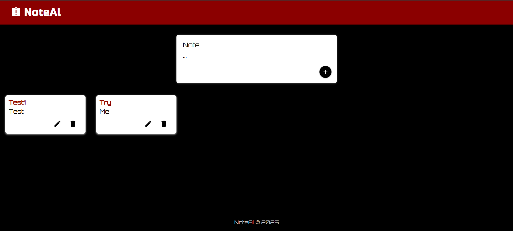
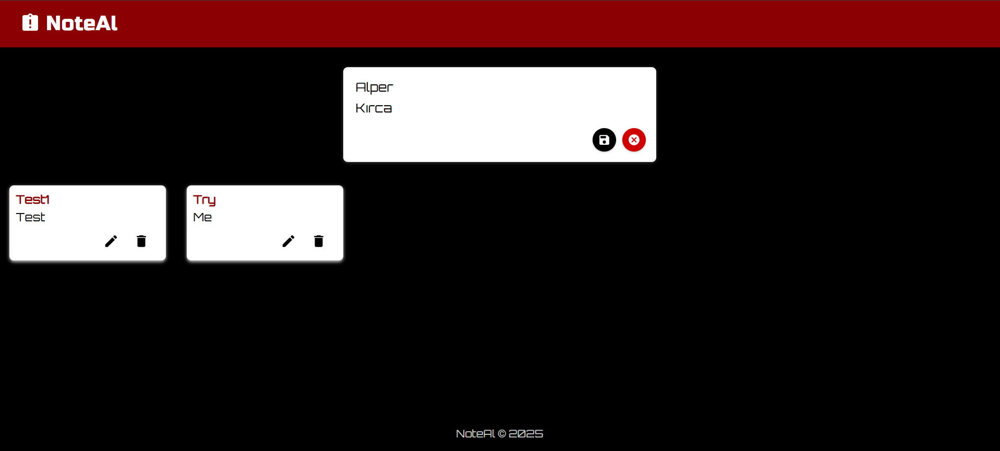
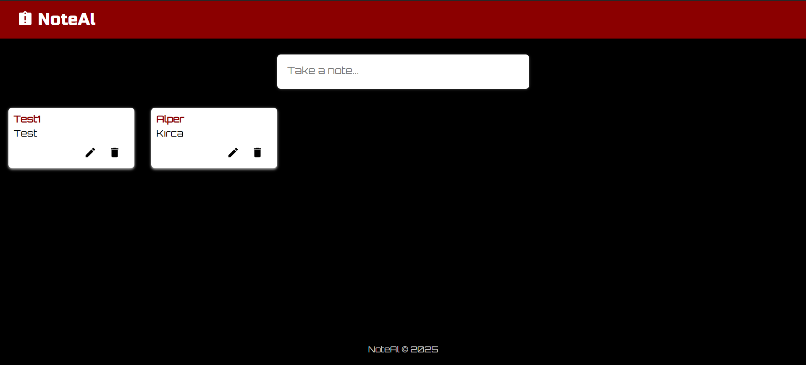

# 📝 NoteAl

> This project was originally inspired by the "Keeper App" example from Angela Yu's Udemy course. Since then, it has evolved into an independent and fully customized application with new features and a unique design.

---

## ✨ Features

- 🧠 Create, edit, and delete notes
- 💾 Persistent storage using `localStorage`
- 🎨 Responsive dark theme with Google Fonts
- ⚙️ Clean UI with Material UI icons and floating action buttons
- ✍️ Expandable input field for better UX

---

## 📸 Preview





---

## 🚀 Built With

- React.js
- Vite
- Material UI
- localStorage API
- Google Fonts (`Orbitron`, `Russo One`)
- CSS Flexbox & Shadow styling

---

## 📦 Installation

```bash
git clone https://github.com/Alcasin/noteal.git
cd noteal
npm install
npm run dev
